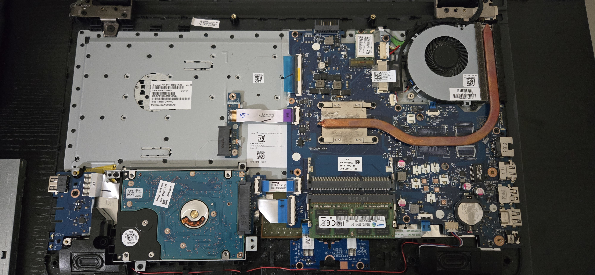

I built my first PC in 2015. It has an i5-6600K CPU, 32GB of RAM, and a 1070Ti GTX GPU. Over a decade later, it is still serving me well and the only aspects that 
have changed are increased RAM from 16GB to 32GB and making the switch from Windows to Ubuntu. One of my coworkers told me that their laptop was sluggish, saying that it could take several minutes to 
boot. I offered to give it a lookover to determine if I could breath new life into it. That new life would be granted by 
exchanging the laptop's HDD for an SSD, and switching from Windows 10 to Linux Mint with an Xfce desktop environment.

Tools
Here is a list of tools that I used.

* Phillips screwdriver
* ESD mat with strap and outlet tester
* USB drive with Ventoy to install Linux Mint
* 2.5" SATA SSD
* USB 3.0 SATA Hard Drive Docking Station
* Spudger
 
The Process

It is best practice to backup the storage prior to performing any work to avoid losing vital information in case things go awry. There was no important information stored on the HDD, so the person said it was okay to wipe the entire drive and no backup was neccessary.


1. Power the laptop and remove the battery.
2. Remove screws on the underside of the laptop, and remove the CD drive. There were two hidden under the rubber pads near the battery.
3. Use a spudger to gently pry the palm rest assembly apart from the bottom case assembly.
4. Identify the HDD and the SATA cable that connects the HDD to the motherboard.
5. Remove the three screws of the two brackets that hold the HDD in place, but do not remove the HDD before disconnecting the SATA cable.
6. Gently remove the SATA cable from the HDD.
7. Remove the brackets from the sides of the HDD by removing the four screws that hold them in place. Place the HDD to the side in a safe location.
8. Screw the brackets onto the replacement SSD drive. There should be two holes on each side of the drive. Note the orientation of the SSD's SATA power and data connectors. They need to align with the connectors of the laptop's SATA cable.
9. Mount the SSD inside the laptop by replacing the three screws that held the bracket in place. Connect the SATA cable to the SSD.
10. Rejoin the assemblies and replace the battery.
11. Plug in the Ventoy USB and power on the laptop. USB was already at the top of the boot order in the UEFI settings.
12. Select the iso that you want to try. This gives you an opportunity to try out an OS before installing it. Mint was selected for this laptop.
13. Click on "Install Linux Mint" to begin the installation.
There will be a pop-up at some point that will provide you the option to "Enroll MOK." It is recommended to select this option instead of continue. I selected "Continue" the first time through, and I ran into issues with Broadcom drivers for the WiFi card.

Once Linux Mint was installed it was time to verify everything worked and to repurpose the old HDD as an external drive.

A Few Quirks after Post Installation

The boot time had a noticeable reduction. What originally took a minute or more is now slashed by over half. The browser and other applications open in a few 
seconds. I connected the HDD via a SATA hard drive docking station, and used **gparted** to reformat it. Its 1TB of space is now free to use. There were a 
couple issues that I had to address. The first was that I noticed that visiting certain pages using FireFox would cause the laptop to become unresponsive. The 
number 1 solution that I saw from my searches was disabling hardware acceleration within the browser. The freezing stopped after turning this off, but I 
downloaded the Chromium browser as an alternative to FireFox. Prior to enrolling MOK, the WiFi would not detect or connect to any wireless networks. The driver 
that was not trusted and caused this was "broadcom-sta-dkms." These two problems were addresses, and now the laptop is ready to return to its owner.
